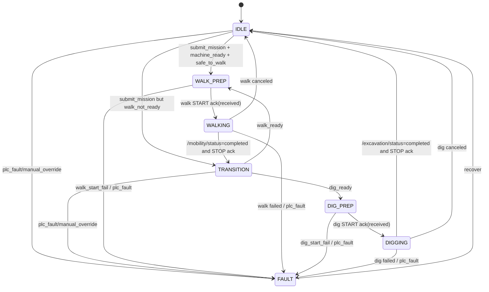

# SYSTEM OVERVIEW AND STARTUP

这份文档用于汇总前面两次沟通里的内容：

1. 当前程序的整体架构与启动方式
2. 四张核心说明图
   - 总体架构图
   - 大规划状态机图
   - 点云到停靠点的数据流图
   - 启动关系图

对应工程根目录：

- `/home/ruhanguo/shovel_robot/whole_planner_v1`

## 1. 当前系统总览

当前工程已经是一个“行走规划 + 挖掘规划 + 上层任务调度 + PLC + 停靠点规划 + 点云边界提取”的一体化工程。

核心分成 5 层：

1. 上位机层
   - 统一上位机入口
   - 一个窗口内切换 `大规划 / 行走规划 / 挖掘规划`
   - 行走页参考 `autowalk_hmi_qt` 的成熟界面，显示地图层、目标点、状态灯和履带速度，并支持地图点选目标
   - 挖掘页直接订阅 `digging/debug/*` 实时画轨迹、优化中间候选轨迹和曲线
   - 入口：
     - [integrated_operator_hmi.py](/home/ruhanguo/shovel_robot/whole_planner_v1/src/mission_operator_hmi/mission_operator_hmi/integrated_operator_hmi.py)

2. 调度层
   - 负责任务接收、状态机、walk/dig 切换、故障收口
   - 入口：
     - [dispatcher_node.py](/home/ruhanguo/shovel_robot/whole_planner_v1/src/mission_dispatcher/mission_dispatcher/dispatcher_node.py)
     - [state_machine.py](/home/ruhanguo/shovel_robot/whole_planner_v1/src/mission_dispatcher/mission_dispatcher/state_machine.py)

3. 规划适配层
   - 行走 action 适配
   - 挖掘 action 适配
   - 停靠点规划
   - 点云边界提取
   - 入口：
     - [mobility action_server.py](/home/ruhanguo/shovel_robot/whole_planner_v1/src/mobility_planner_core/mobility_planner_core/action_server.py)
     - [excavation action_server.py](/home/ruhanguo/shovel_robot/whole_planner_v1/src/excavation_planner_core/excavation_planner_core/action_server.py)
     - [material_target_planner.py](/home/ruhanguo/shovel_robot/whole_planner_v1/src/mobility_planner_core/mobility_planner_core/material_target_planner.py)
     - [material_boundary_extractor.py](/home/ruhanguo/shovel_robot/whole_planner_v1/src/mobility_planner_core/mobility_planner_core/material_boundary_extractor.py)

4. legacy 核心层
   - 行走 legacy：`autonomous_walk`
   - 挖掘 legacy：`trajectory_planner + load + return + PRSdata_send`
   - 路径：
     - [vendor mobility](/home/ruhanguo/shovel_robot/whole_planner_v1/src/vendor/mobility_planner_core)
     - [vendor excavation](/home/ruhanguo/shovel_robot/whole_planner_v1/src/vendor/excavation_planner_core)

5. 设备与状态层
   - PLC 状态接入
   - mock PLC / real PLC
   - 入口：
     - [plc_adapter_node.py](/home/ruhanguo/shovel_robot/whole_planner_v1/src/plc_adapter/plc_adapter/plc_adapter_node.py)

## 2. 当前主流程

当前系统的上层任务流是：

```text
外部 submit_mission
  -> mission_dispatcher
    -> 如 use_material_target=true:
       /mobility/compute_material_target
         -> 直接 material_outline
         -> 或 boundary_input.outline_points / line_strips / scatter_points
         -> 或 boundary_input.source=pointcloud 时调用 /mobility/extract_material_boundary
    -> 得到 resolved_walk_target
    -> 发 /mobility/execute START
    -> 监听 /mobility/status
    -> walk completed 后发 STOP
    -> 切到 dig
    -> 发 /excavation/execute START
    -> 监听 /excavation/status
    -> dig completed 后发 STOP
    -> 回到 IDLE
```

## 3. 当前大规划状态机

当前主状态包括：

- `IDLE`
- `WALK_PREP`
- `WALKING`
- `DIG_PREP`
- `DIGGING`
- `TRANSITION`
- `FAULT`

当前主控制逻辑：

1. 收任务
2. 判断 PLC 是否允许 walk
3. 发送 walk `START`
4. walk 到点并做终点距离复核
5. 发送 walk `STOP`
6. 判断 PLC 是否允许 dig
7. 发送 dig `START`
8. dig 循环直到满足结束条件
9. 发送 dig `STOP`
10. 回 `IDLE`

dig 当前结束条件：

1. 连续 3 次规划无结果
2. 相对回转角达到 `120 deg`

## 4. walk / dig 命令协议

统一 action 命令：

- `START=1`
- `STOP=2`
- `CANCEL=3`

接口定义：

- [WalkMission.action](/home/ruhanguo/shovel_robot/whole_planner_v1/src/integrated_mission_interfaces/action/WalkMission.action)
- [DigMission.action](/home/ruhanguo/shovel_robot/whole_planner_v1/src/integrated_mission_interfaces/action/DigMission.action)

语义：

- action result 只表示“收到”
- 长时执行状态全部走 topic

状态 topic：

- `/mobility/status`
- `/excavation/status`

消息定义：

- [SubsystemStatus.msg](/home/ruhanguo/shovel_robot/whole_planner_v1/src/integrated_mission_interfaces/msg/SubsystemStatus.msg)

## 5. walk 当前完成条件

walk 不是单纯导航成功就算结束，而是：

1. 导航成功
2. 当前位置与目标点做距离复核
3. 小于容差才算完成

关键实现：

- [autonomous_walk_node.cpp](/home/ruhanguo/shovel_robot/whole_planner_v1/src/vendor/mobility_planner_core/applications/autonomous_walk/src/autonomous_walk_node.cpp)

## 6. dig 当前完成条件

dig 的收口条件当前是：

1. 连续 3 次规划无结果
2. 回转相对角达到 `120 deg`

关键实现：

- [legacy_dig_planner_orchestrator.py](/home/ruhanguo/shovel_robot/whole_planner_v1/src/excavation_planner_core/excavation_planner_core/legacy_dig_planner_orchestrator.py)

并且 dig 的 `CANCEL` 已经打到底：

- orchestrator
- `digging/cancel`
- `trajectory_planner`
- `load`
- `return`

## 7. 停靠点规划结构

`/mobility/compute_material_target` 目前已经拆成三层：

1. `boundary_fit`
2. `work_band`
3. `candidate_evaluation`

关键文件：

- [material_target_input.py](/home/ruhanguo/shovel_robot/whole_planner_v1/src/mobility_planner_core/mobility_planner_core/material_target_input.py)
- [material_target_layers.py](/home/ruhanguo/shovel_robot/whole_planner_v1/src/mobility_planner_core/mobility_planner_core/material_target_layers.py)
- [material_target_planner.py](/home/ruhanguo/shovel_robot/whole_planner_v1/src/mobility_planner_core/mobility_planner_core/material_target_planner.py)

目前支持的几何输入：

- request `material_outline`
- `boundary_input.outline_points`
- `boundary_input.line_strips`
- `boundary_input.scatter_points`
- `boundary_input.source=pointcloud` 时走在线点云边界提取

## 8. 点云边界提取结构

点云边界链路当前为：

```text
PointCloud2
  -> material_boundary_extractor
  -> /mobility/extract_material_boundary
  -> material_target_planner
```

关键接口与实现：

- [ExtractMaterialBoundary.srv](/home/ruhanguo/shovel_robot/whole_planner_v1/src/integrated_mission_interfaces/srv/ExtractMaterialBoundary.srv)
- [material_boundary_extractor.py](/home/ruhanguo/shovel_robot/whole_planner_v1/src/mobility_planner_core/mobility_planner_core/material_boundary_extractor.py)

当前提取器做的事：

- 订阅最新 `PointCloud2`
- 读取 `x/y/z`
- 做 `z` 过滤
- 做 ROI 裁剪
- 做角度分桶
- 形成 2D 边界点

## 9. 当前坐标系处理规则

当前系统没有 `tf` 树，因此现在采取的是严格策略：

1. 如果点云 frame 和目标规划 frame 一致
   - 直接用
2. 如果不一致，但配置了静态外参
   - 先做静态变换，再提边界
3. 如果不一致，也没静态外参
   - 直接失败，不继续算

也就是说，当前代码不会默认假设“反正差不多在同一个坐标系”。

## 10. 启动方式

### 10.1 推荐构建

建议优先使用标准构建入口：

```bash
cd /home/ruhanguo/shovel_robot/whole_planner_v1
bash scripts/build_workspace.sh
```

### 10.2 启动主系统

```bash
cd /home/ruhanguo/shovel_robot/whole_planner_v1
bash scripts/run_profile.sh integrated
```

启动文件：

- [integrated.launch.py](/home/ruhanguo/shovel_robot/whole_planner_v1/src/mission_bringup/launch/integrated.launch.py)

默认会拉起：

- `plc_adapter`
- `mobility_action_server`
- `material_target_planner`
- `material_boundary_extractor`
- `lite_slam_swing_angle_bridge`
- `excavation_action_server`
- `mission_dispatcher`
- `integrated_operator_hmi`，当 `launch_operator_hmi:=true` 时
- `mock_nav2_server`
- `autonomous_walk`
- `PRSdata_send`
- `trajectory_planner`
- `load`
- `return`
- `legacy_dig_planner_orchestrator`

### 10.3 提交 demo 任务

```bash
cd /home/ruhanguo/shovel_robot/whole_planner_v1
source install/setup.bash
ros2 run mission_dispatcher submit_demo_mission
```

### 10.4 接真实点云 topic

```bash
cd /home/ruhanguo/shovel_robot/whole_planner_v1
bash scripts/run_profile.sh integrated material_point_cloud_topic:=/your/point_cloud_topic
```

### 10.5 点云 frame 不一致时，按机型加载静态外参

`integrated.launch.py` 现在会自动读取：

- `config/perception/material_boundary_extrinsic/<machine_model>.yaml`
- 如果机型文件不存在，则回退到 `config/perception/material_boundary_extrinsic/default.yaml`

推荐先把固定外参写到机型文件里，再按机型启动：

```bash
cd /home/ruhanguo/shovel_robot/whole_planner_v1
bash scripts/run_profile.sh integrated \
  machine_model:=prototype \
  material_point_cloud_topic:=/your/point_cloud_topic
```

当前示例配置文件：

- [default.yaml](/home/ruhanguo/shovel_robot/whole_planner_v1/config/perception/material_boundary_extrinsic/default.yaml)
- [prototype.yaml](/home/ruhanguo/shovel_robot/whole_planner_v1/config/perception/material_boundary_extrinsic/prototype.yaml)

如果只是临时调试，也可以继续用 launch 参数覆盖 YAML 里的外参值：

```bash
cd /home/ruhanguo/shovel_robot/whole_planner_v1
bash scripts/run_profile.sh integrated \
  material_point_cloud_topic:=/your/point_cloud_topic \
  use_boundary_static_extrinsic:=true \
  boundary_sensor_frame_id:=your_sensor_frame \
  boundary_extrinsic_translation_x_m:=1.2 \
  boundary_extrinsic_translation_y_m:=0.0 \
  boundary_extrinsic_translation_z_m:=2.4 \
  boundary_extrinsic_roll_deg:=0.0 \
  boundary_extrinsic_pitch_deg:=0.0 \
  boundary_extrinsic_yaw_deg:=90.0
```

### 10.6 单独跑点云边界链

终端 1：

```bash
cd /home/ruhanguo/shovel_robot/whole_planner_v1
source install/setup.bash
ros2 run mobility_planner_core material_boundary_extractor
```

终端 2：

```bash
cd /home/ruhanguo/shovel_robot/whole_planner_v1
source install/setup.bash
ros2 run mobility_planner_core material_target_planner --ros-args -p enable_boundary_extractor:=true
```

然后外部：

- 发布 `PointCloud2`
- 调 `/mobility/compute_material_target`

### 10.7 启动统一上位机

单独启动：

```bash
cd /home/ruhanguo/shovel_robot/whole_planner_v1
bash scripts/run_profile.sh hmi
```

随主系统一起启动：

```bash
cd /home/ruhanguo/shovel_robot/whole_planner_v1
bash scripts/run_profile.sh integrated launch_operator_hmi:=true
```

当前统一上位机提供：

- `大规划` 页签
  - 开始自动
  - 停止/取消
  - 恢复
  - 手动提交任务
  - 提交示例任务
  - 手动切行走 / 停止行走
  - 手动切挖掘 / 停止挖掘
- `行走规划` 页签
  - 当前位姿
  - `map/global_costmap/local_costmap`
  - 手动目标
  - 地图点选目标
  - 自动目标
  - 规划路径
  - 物料边界
  - 状态灯与履带速度曲线
- `挖掘规划` 页签
  - dig 阶段与详情
  - 回转角
  - `trajectory_planner` 三段实时轨迹
  - 优化中间候选轨迹与当前指标
  - 推压/提升速度曲线
  - `load/return` 回转曲线

## 11. 四张核心说明图

### 11.1 总体架构图

```mermaid
flowchart TB
    EXT[外部/HMI/调度系统] --> SUBMIT[/mission_dispatcher/submit_mission]
    EXT --> START[/mission_dispatcher/start]
    EXT --> STOP[/mission_dispatcher/stop]
    EXT --> RECOVER[/mission_dispatcher/recover]

    PLC[plc_adapter\n/plc/status] --> DISP[mission_dispatcher\n上层任务调度]

    SUBMIT --> DISP
    START --> DISP
    STOP --> DISP
    RECOVER --> DISP

    DISP -->|WalkMission START/STOP/CANCEL| WACT[mobility_action_server]
    DISP -->|DigMission START/STOP/CANCEL| DACT[excavation_action_server]

    DISP -->|use_material_target=true| MTP[/mobility/compute_material_target]
    MTP --> MTP_NODE[material_target_planner]

    MTP_NODE -->|需要点云边界时| EXTSVC[/mobility/extract_material_boundary]
    EXTSVC --> EXT_NODE[material_boundary_extractor]
    PC[PointCloud2] --> EXT_NODE

    WACT -->|service| AW[autonomous_walk]
    AW --> NAV[mock_nav2 / nav2]
    NAV --> AW
    AW -->|legacy status| WACT
    WACT -->|/mobility/status| DISP

    DACT -->|/dig/start /dig/stop| DORCH[legacy_dig_planner_orchestrator]
    DORCH --> TRAJ[trajectory_planner]
    DORCH --> LOAD[load]
    DORCH --> RET[return]
    PRS[prsdata_server] --> TRAJ
    TRUCK[perceive_truck_server] --> TRAJ
    ANGLE[lite_slam_swing_angle_bridge\n/lite_slam/swing_angle_deg] --> DORCH
    DORCH -->|/excavation/status| DACT
    DACT -->|/excavation/status| DISP
```

### 11.2 大规划状态机图



### 11.3 点云到停靠点的数据流图

```mermaid
flowchart LR
    PC[PointCloud2] --> EXTRACTOR[material_boundary_extractor]

    CFG1[boundary_input 配置\nz/roi/angular_bins/min_boundary_radius] --> EXTRACTOR
    CFG2[静态外参\nxyz+rpy] --> EXTRACTOR

    EXTRACTOR --> CHECK{cloud frame\n是否等于目标frame?}
    CHECK -- 是 --> FILTER[Z过滤 + ROI裁剪]
    CHECK -- 否且有静态外参 --> TF[静态外参变换]
    TF --> FILTER
    CHECK -- 否且无外参 --> FAIL[直接失败]

    FILTER --> BINS[角度分桶/边界抽取]
    BINS --> OUTLINE[/mobility/extract_material_boundary\nboundary_outline]

    OUTLINE --> MTP[material_target_planner]
    MTP --> INPUT[geometry_input / resolved_outline]
    INPUT --> BF[boundary_fit]
    BF --> WB[work_band]
    WB --> CE[candidate_evaluation]
    CE --> TARGET[resolved_walk_target]

    TARGET --> DISP[mission_dispatcher]
    DISP --> WALK[/mobility/execute START]
```

### 11.4 启动关系图

```mermaid
flowchart TB
    LAUNCH[integrated.launch.py] --> PLC[plc_adapter]
    LAUNCH --> DISP[mission_dispatcher]
    LAUNCH --> WACT[mobility_action_server]
    LAUNCH --> MTP[material_target_planner]
    LAUNCH --> MBE[material_boundary_extractor]
    LAUNCH --> SWING[lite_slam_swing_angle_bridge]
    LAUNCH --> DACT[excavation_action_server]
    LAUNCH --> NAV[mock_nav2_server]
    LAUNCH --> AW[autonomous_walk]

    LAUNCH --> PRS[prsdata_server]
    LAUNCH --> TRUCK[perceive_truck_server]
    LAUNCH --> TRAJ[trajectory_planner]
    LAUNCH --> LOAD[load]
    LAUNCH --> RET[return]
    LAUNCH --> DORCH[legacy_dig_planner_orchestrator]

    MBE -.订阅.-> PCTOPIC[/material/point_cloud]
    DISP -.调用.-> MTP
    MTP -.调用.-> MBE
    DISP -.action.-> WACT
    DISP -.action.-> DACT
    WACT -.后端.-> AW
    DACT -.后端.-> DORCH
    DORCH -.驱动.-> TRAJ
    DORCH -.驱动.-> LOAD
    DORCH -.驱动.-> RET
```

## 12. 当前验证结果

干净回归结果：

- `mobility_planner_core`: `24 tests`
- `mission_dispatcher`: `4 tests`
- `excavation_planner_core`: `7 tests`
- `plc_adapter`: `1 test`
- 合计：`36 tests, 0 errors, 0 failures`

另外，运行态探针已经确认：

- `PointCloud2 -> material_boundary_extractor -> material_target_planner` 实际可跑
- `geometry_source=pointcloud_boundary_extractor`
- `extractor_status=ok`

## 13. 相关主文档

如果需要继续看正式文档，请参考：

- [ARCHITECTURE.md](/home/ruhanguo/shovel_robot/whole_planner_v1/docs/ARCHITECTURE.md)
- [INTERFACES.md](/home/ruhanguo/shovel_robot/whole_planner_v1/docs/INTERFACES.md)
- [RUNBOOK.md](/home/ruhanguo/shovel_robot/whole_planner_v1/docs/RUNBOOK.md)
- [CHANGELOG_PHASED.md](/home/ruhanguo/shovel_robot/whole_planner_v1/docs/CHANGELOG_PHASED.md)
